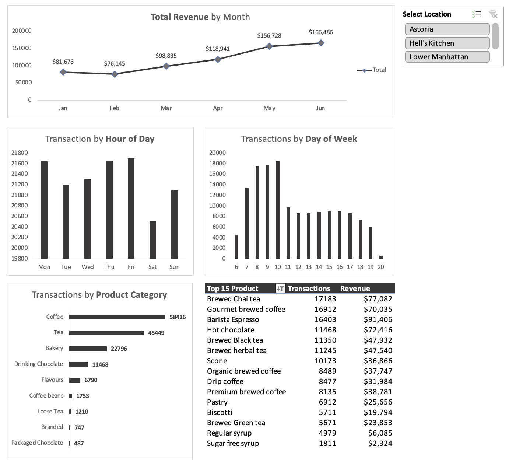

# coffee-sales-dashboard
Interactive Excel dashboard analyzing coffee shop sales trends with actionable business insights.

# Coffee Sales Dashboard (Excel)

> Author: **nazreeninsights**

This project analyzes retail coffee shop sales and builds an interactive dashboard to uncover trends by **month**, **day of week**, **hour**, **product category**, and **top products**. It includes clear recommendations to improve operations across store locations.

<p align="center">
  
</p>

---

## 📦 Repository Structure

```
├── data/
│ └── Coffee_Shop_Sales.xlsx
├── docs/
│ ├── Coffee_shop_questions.pdf
│ └── Maven_Roasters_Dashboard_Analysis.pdf
├── assets/
│ ├── hero_dashboard.png
│ ├── astoria_dashboard.png
│ ├── hells_kitchen_dashboard.png
│ └── lower_manhattan_dashboard.png
└── README.md
```

---

## 🎯 Objectives

1. **Prepare the data** — add Revenue, Month, Day of Week, and Hour columns for analysis.
2. **Explore with PivotTables** — analyze revenue by mont. Transactions by day/week and hour. Category mix. And Top 15 products.
3. **Build a dashboard** — connect slicers (Store Location), add PivotCharts, and polish for presentation.
4. **Deliver insights & recommendations** — operational, menu, and marketing actions.

---

## 🧰 Tools & Tech

- **Excel** — data prep, PivotTables, PivotCharts
- **Word** — findings write-up (docx)

---

## 🔎 Key Insights (Summary)

- **Monthly revenue** rises steadily from **January to June** (over 100% increase across locations).
- **Peak trading** is **morning (9–11 AM)**; **weekends underperform** vs. weekdays.
- **Coffee** is the top category; **Tea & Hot Chocolate** also contribute meaningfully.
- **Top products** include **Barista Espresso**, **Chai Tea**, and **Hot Chocolate** across stores.

> See `docs/Maven_Roasters_Dashboard_Analysis.pdf` for location-by-location detail.

---

## ✅ Recommendations

- **Afternoon “Happy Hour” (2–5 PM)** to lift post-lunch dips.
- **Weekend promos** (family bundles, brunch sets, remote-worker specials) to improve Sat/Sun traffic.
- **Menu optimization** — focus on high-margin espresso. Rationalize low-performers (sugar-free syrups/packaged items).
- **Loyalty program** — points, referrals, and birthday perks.
- **Smart staffing** — heavier coverage in morning rush. Leaner teams on slow periods.

---

## 📸 Screenshots

Place PNGs/JPGs in the `assets/` folder with the **exact** filenames below:

- `assets/hero_dashboard.png` — overview or your favorite composite view
- `assets/astoria_dashboard.png`
- `assets/hells_kitchen_dashboard.png`
- `assets/lower_manhattan_dashboard.png`

Then the images will render automatically in this README.

---

## ▶️ How to Use

### Excel
1. Open `data/Coffee_Shop_Sales.xlsx`.
2. Use the prepared fields (Revenue, Month, Day, Hour) to create PivotTables/Charts.
3. Add a **Store Location** slicer and connect to all PivotTables.
4. Save dashboard as a new sheet and export screenshots to `assets/`.


---

## 📄 Data Dictionary (selected)

| Field           | Type     | Example     | Notes                                    |
|----------------|----------|-------------|------------------------------------------|
| `transaction_date` | Date  | 2024-03-12  | Use to derive **Month** & **DayOfWeek**  |
| `transaction_time` | Time  | 10:15       | Use to derive **Hour**                   |
| `product`      | Text     | Barista Espresso |                                          |
| `category`     | Text     | Coffee      |                                          |
| `price`        | Decimal  | 4.50        |                                          |
| `quantity`     | Integer  | 2           |                                          |
| `revenue`      | Decimal  | 9.00        | `price * quantity`                       |
| `store`        | Text     | Astoria     | Use as **slicer**                         |

---

## 🚀 Getting Started (GitHub)

```bash
# 1) Create a new repo on GitHub named: coffee-sales-dashboard
# 2) On your computer, place project files in a folder with this structure
# 3) Then run:

https://github.com/nazreeninsights/coffee-sales-dashboard

